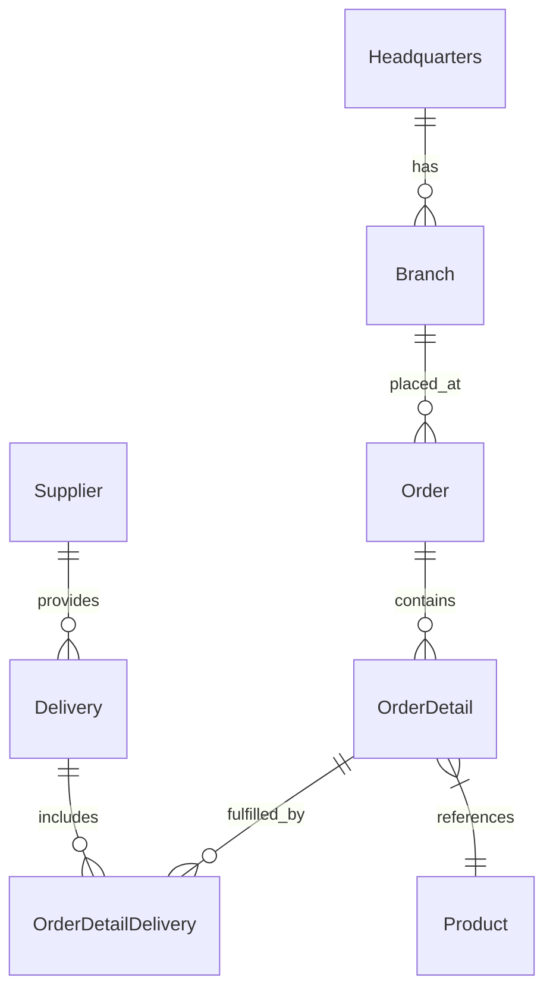
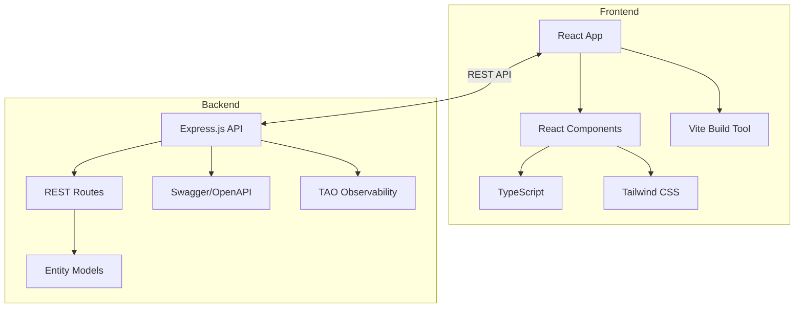

# OctoCAT Supply Chain Management System Architecture

This site is a demo application written in TypeScript. The entire app was created originally from an [ERD diagram](../api/ERD.png) and natural language prompts using Copilot. The frontend was created in the same way, using some of the design ideas in [the design folder](./design/).

The hero image and product images were created by prompting ChatGPT!

## Architecture Overview

The system is a modern supply chain management application built using TypeScript, comprising a backend REST API and a React frontend. It's designed to demonstrate Copilot capabilities using a fairly typical architecture with a little complexity, but not enough to derail demos!

### Backend Architecture
- Express.js API with RESTful endpoints for all entities
- Swagger/OpenAPI documentation integration
- Entity models with proper relationships following an ERD diagram

### Frontend Architecture
- React 18+ with TypeScript
- Vite build tool for fast development
- Tailwind CSS for UI styling

### DevOps Integration
- Docker/Docker Compose for containerization

## ERD

## Component Architecture

## Key Features

- Complete REST APIs for all supply chain entities
- Detailed OpenAPI documentation, generated by Copilot
- Modern React UI with responsive design, generated by Copilot using images
- Containerization for consistent deployment, generated by Copilot