# Model Comparison Table

This comparison was genereated using the custom prompt file [model-compare.prompt.md](../.github/prompts/model-compare.prompt.md) and using `Gemini 2.5 Pro`. You can generatae you own using `/model-compare` in the Copilot Chat.

> [!NOTE]
> As the model world is moving quickly, the information in this predefined document might be outdated. Use the `/model-compare` command as described above to get a file with the latest information.

## 1. Balance Between Performance and Cost

**Pros:** Good all-rounders, versatile, cost-effective options.

| Model             | Use Case / Differentiator               | GA/Preview | Special Abilities      | Multiplier         |
| ----------------- | --------------------------------------- | ---------- | ---------------------- | ------------------ |
| GPT-4.1           | Default for common dev, broad knowledge | ✅          | Multilingual, 👓 Visual | 0 (paid), 1 (free) |
| Claude 3.7 Sonnet | Advanced dev, architectural planning    | ✅          | -                      | 1                  |

## 2. Fast, Low-Cost Support for Basic Tasks

**Pros:** Speed 🚀, low latency, cost savings 💸, simple logic, quick feedback.

| Model             | Use Case / Differentiator                 | GA/Preview | Special Abilities | Multiplier |
| ----------------- | ----------------------------------------- | ---------- | ----------------- | ---------- |
| o4-mini           | Fastest, most efficient for basic tasks   | 🚧          | -                 | -          |
| Claude 3.5 Sonnet | Everyday coding, documentation, low cost  | ✅          | -                 | 1          |
| o3-mini           | Fast, concise for simple/repetitive tasks | ✅          | -                 | 0.33       |

## 3. Deep Reasoning & Complex Coding Challenges

**Pros:** Advanced logic, multi-step problem solving, high-quality code generation.

| Model          | Use Case / Differentiator                    | GA/Preview | Special Abilities | Multiplier |
| -------------- | -------------------------------------------- | ---------- | ----------------- | ---------- |
| GPT-4.5        | Multi-step logic, nuanced, high-quality code | ✅          | -                 | 50 💰       |
| o3             | Deepest reasoning, debugging, complex tasks  | 🚧          | -                 | -          |
| o1             | Deep logic, debugging, root cause analysis   | ✅          | -                 | 10 💰       |
| Gemini 2.5 Pro | Advanced algorithms, long-context research   | 🚧          | -                 | 1          |

## 4. Multimodal Inputs & Real-Time Performance

**Pros:** Visual input 👓, real-time interaction, UI/diagram analysis.

| Model            | Use Case / Differentiator                     | GA/Preview | Special Abilities      | Multiplier |
| ---------------- | --------------------------------------------- | ---------- | ---------------------- | ---------- |
| GPT-4o           | Lightweight dev, conversational, visual input | ✅          | 👓 Visual, Multilingual | 1          |
| Gemini 2.0 Flash | UI inspection, diagram analysis, visual bugs  | ✅          | 👓 Visual               | 0.25 💸     |

---

## References

- [Choosing the right AI model for your task](https://docs.github.com/en/copilot/using-github-copilot/ai-models/choosing-the-right-ai-model-for-your-task)
- [About premium requests](https://docs.github.com/en/enterprise-cloud@latest/copilot/managing-copilot/monitoring-usage-and-entitlements/about-premium-requests?versionId=enterprise-cloud%40latest)

---

## Model Summary Overview: Performance vs. Quality & Cost

```mermaid
graph LR
    %% Performance Category
    subgraph "Performance (Faster - Lower Cost/Complexity)"
      o4m["o4-mini<br/>🚀💸<br/>(Preview)"]
      g2f["Gemini 2.0 Flash<br/>🚀💸👓<br/>(GA)"]
      o3m["o3-mini<br/>🚀💸<br/>(GA)"]
      c35s["Claude 3.5 Sonnet<br/>🚀<br/>(GA)"]
      o4m --> g2f
      g2f --> o3m
      o3m --> c35s
    end

    %% Balanced Category
    subgraph "Balanced"
    direction TB
    g41["GPT-4.1<br/>✅<br/>(Base Model)"]
    g4o["GPT-4o<br/>👓<br/>(GA)"]
    g41 --> g4o
    end

    %% Quality & Cost Category
    subgraph "Quality & Cost (Higher - Higher Cost/Complexity)"
    direction TB
    c37s["Claude 3.7 Sonnet<br/>✅<br/>(GA)"]
    g25p["Gemini 2.5 Pro<br/>🚧<br/>(Preview)"]
    o1["o1<br/>💰<br/>(GA)"]
    o3["o3<br/>🚧💰<br/>(Preview)"]
    g45["GPT-4.5<br/>✅💰💰<br/>(GA)"]
    c37s --> g25p
    g25p --> o1
    o1 --> o3
    o3 --> g45
    end

    %% Horizontal connections between categories
    c35s -.-> g41
    g4o -.-> c37s

    %% Styling
    style o4m fill:#f9f,stroke:#333,stroke-width:2px,color:#000
    style g2f fill:#f9f,stroke:#333,stroke-width:2px,color:#000
    style o3m fill:#f9f,stroke:#333,stroke-width:2px,color:#000
    style c35s fill:#f9f,stroke:#333,stroke-width:2px,color:#000
    style g41 fill:#9cf,stroke:#333,stroke-width:2px,color:#000
    style g4o fill:#9cf,stroke:#333,stroke-width:2px,color:#000
    style c37s fill:#9fc,stroke:#333,stroke-width:2px,color:#000
    style g25p fill:#9fc,stroke:#333,stroke-width:2px,color:#000
    style o1 fill:#9fc,stroke:#333,stroke-width:2px,color:#000
    style o3 fill:#9fc,stroke:#333,stroke-width:2px,color:#000
    style g45 fill:#9fc,stroke:#333,stroke-width:2px,color:#000
```

